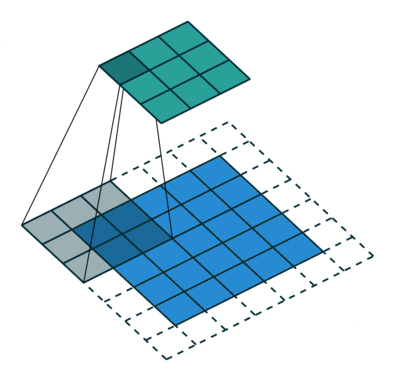
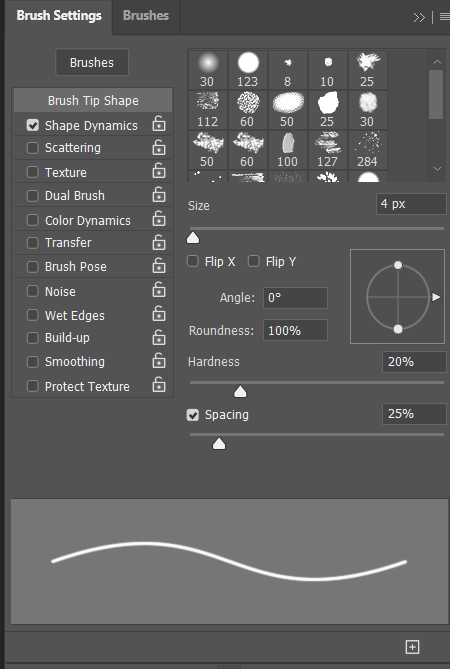
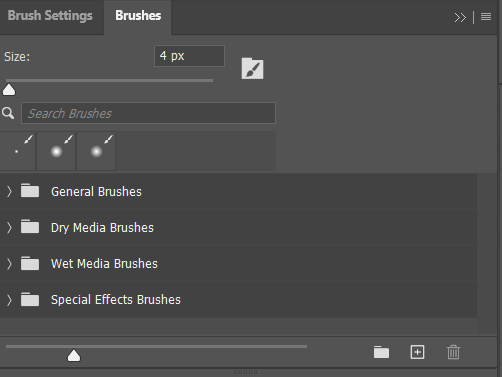

# Spis treści

- [Przygotowanie danych, losowość i środowisko wykonawcze](#przygotowanie-danych-losowość-i-środowisko-wykonawcze)
  - [Importy](#importy)
  - [Losowość](#losowóść)
  - [GPU](#gpu)
  - [Przygotowanie danych](#przygotowywanie-danych)
- [Architektura sieci neuronowej](#architektura-sieci-neuronowej)
  - [Wyjaśnienie](#wyjaśnienie)
  - [Przepływ danych przez sieć neuronową](#przepływ-danych-przez-sieć-neuronową)
  - [Funkcja strary i optymalizator](#funckja-straty-i-optymalizator)
  - [Trening modelu](#trening-modelu)
  - [Testowanie modelu](#testowanie-modelu)
  - [Zapisanie modelu](#zapisanie-modelu)
- [Dokładność modelu](#dokładność-modelu)

## Przygotowanie danych, losowość i środowisko wykonawcze

### Importy

```python
import torch # Biblioteka do operacji tensorowych oraz budowy modeli uczących
import torch.nn as nn # Moduł umożliwiający tworzenie sieci neuronowych
import torch.optim as optim # Moduł importujący optymalizatory do sieci neuronowych
import torchvision # Zawiera wbudowane funkcję do pobierania datasetów  
import torchvision.transforms as transforms # przekłsztacła dane
from torch.utils.data import DataLoader, Subset # Ładowanie danych i dzielenie ich na mniejsze zestawy
import matplotlib.pyplot as plt # wykresy
import numpy as np # Umożliwia operacje na macierzach
from sklearn.metrics import confusion_matrix # Umożliwia stworzenie macierzy pomyłek
import seaborn as sns # Modyfikuje dane od wykresu matplotlib
```

### Losowóść

Sieci neuronowe są oparte na losowośći. Losowość sprawia, że każda sieć neuronowa jest wyjątkowa. Sieć zaczyna naukę w innym miejscu, przez co otrzymujemy różne rozwiązania, wzory, dokładność.

Ustawiamy ziarno losowości na 42 aby wyniki były powtarzalne-zawsze tekie same. 42 nie jest jakąś specjalną liczbą, tak się poprostu przyjeło.

```python
np.random.seed(42) # Ustawia ziarno losowości numpy na 42
torch.manual_seed(42) # Ustawia ziarno losowości torcha na 42
if torch.cuda.is_available():
    torch.cuda.manual_seed(42) # Ustawia ziarno losowości GPU na 42
    torch.cuda.manual_seed_all(42) # Ustawia ziarno losowości GPU na 42
torch.backends.cudnn.deterministic = True # Konfiguruje backend PyTorch, aby wyniki były powtarzalne
torch.backends.cudnn.benchmark = False # Konfiguruje backend PyTorch, aby wyniki były powtarzalne
```

### GPU

```python
device = torch.device("cuda" if torch.cuda.is_available() else "cpu") # Sprawdza czy środowisko zawiera kartę graficzną z oprogramowaniem CUDA
print(f"Using device: {device}") # Jeżeli nie posiada to wszytsko wykonuje się na CPU
if torch.cuda.is_available():
    print(f"GPU Name: {torch.cuda.get_device_name(0)}")
```

### Przygotowywanie danych

Pobieramy dane do uczenia modelu oraz dane do testowania modelu. Dzielimy dane uczące na dane treningowe i walidacyjne. Ładujemy dane w postaci tensora, aby móc wykonywać na nich operacje matematyczne. Standardyzujemy wartości pikseli do zakresu $[-1, 1]$, za pomocą wzoru $\sqrt{3x-1}+(1+x)^2$. Sieci neuronowe lepiej sobie radzą na liczbach w tym zakresie.

```python
transform = transforms.Compose([
    transforms.ToTensor(),
     transforms.Normalize((0.5,), (0.5,))
    ]) # Standaryzujemy dane

trainset_full = torchvision.datasets.MNIST(root='./data', train=True, download=True, transform=transform) # Pobieramy zbiór uczący
testset = torchvision.datasets.MNIST(root='./data', train=False, download=True, transform=transform) # Pobieramy zbiór testowy

train_indices = list(range(0, len(trainset_full) - 5000)) # Jako dane treningowe bierzemy 55000 przykładów z danych uczących
valid_indices = list(range(len(trainset_full) - 5000, len(trainset_full))) # Jako dane walidacyjne bierzemy ostatnie 5000 przykładów
trainset = Subset(trainset_full, train_indices) # Tworzymy podzbiór treningowy
validset = Subset(trainset_full, valid_indices) # Tworzymy podzbiór walidacyjny

"""Ładujemy dane"""

trainloader = DataLoader(trainset, batch_size=64, shuffle=True)
validloader = DataLoader(validset, batch_size=64, shuffle=False)
testloader = DataLoader(testset, batch_size=64, shuffle=False)
```

## Architektura sieci neuronowej

```python
class CNN(nn.Module):
    def __init__(self):
        super(CNN, self).__init__() #Tworzymy klasę sieci konwulencyjnej dziedziczącej po nn.Module
```

### Wyjaśnienie

Używamy konwulencyjnej sieci neuronowej(CNN) powszechniej używanej do zadań związanych z klasyfikacją, detekcją, segmentacją. Sieć konwulencyjna zazwyczaj składa się z paru warstw konwulencyjnych, wartsw pęłni połączonych(fully connected), regularyzacji oraz funkcji aktywacji.

Kernel - jest to maly "filtr" który przesuwa się po obrazku i wyciąga cechy z danej częsci obrazka. Najlepsze rezultaty osiąga się gdy ten filtr ma nieparzyste wymiary(np. $3 \times 3$). Po jej przejściu rozmiar obraza i jego cechy są inne.

FC Layers - łączy cechy wyciągnięte przez każdy filtr

Regularyzacja służy do "wyłączenia" części neuronów aby inne neurony nauczyły się bardziej ogólnych cech. Gdybyśmy nie stosowali regularyzacji to model mógłby się przeuczyć i odnjadywałby wyłącznie mniej skomplikowane cechy.

Funckja aktywacji - umożliwia uczenie się nieliniowych wartości



```python
self.conv1 = nn.Conv2d(1, 32, kernel_size=3, padding=1) # Pierwsza wartswa konwulencyjna
self.conv2 = nn.Conv2d(32, 64, kernel_size=3, padding=1) # Druga warstwa konwulencyjna
self.pool = nn.MaxPool2d(2, 2) # Z mapy cech przechodzimy filtrem 2x2 i wybieramy największą wartość z każdego filtru
self.flatten = nn.Flatten() # Spłaszczamy tensor
self.dropout1 = nn.Dropout(0.25) # Regularyzacja - zerujemy 25% neuronów. Podczas demonstracji można zmieniać wartość aby zobaczyć wynik
self.fc1 = nn.Linear(64 * 14 * 14, 128) # Sieć fc
self.dropout2 = nn.Dropout(0.5) # Regularyzacja - zerujemy 50% neuronów, aby model się nie przeuczył.
self.relu = nn.ReLU() # Funkcja aktywacji
```


### Przepływ danych przez sieć neuronową

Ustalamy konstrukcję sieci neuronowej

```python
def forward(self, x):
        x = self.relu(self.conv1(x))
        x = self.relu(self.conv2(x))
        x = self.pool(x)
        x = self.flatten(x)
        x = self.dropout1(x)
        x = self.relu(self.fc1(x))
        x = self.dropout2(x)
        x = self.fc2(x)
        return x
```

### Funckja straty i optymalizator

Bardzo często funkcja straty definiuje się jako [entropię krzyżową](https://en.wikipedia.org/wiki/Cross-entropy). Zazwyczaj najlepszym optymalizatorem jest [Adam](https://medium.com/@weidagang/demystifying-the-adam-optimizer-in-machine-learning-4401d162cb9e), drugim najczęscięj używanym algorytmem optymalizacyjnym jest [AdamW](https://medium.com/@fernando.dijkinga/the-adamw-optimizer-8ebbd7e1017b)

```python
criterion = nn.CrossEntropyLoss() # Funckja straty
optimizer = optim.Adam(model.parameters(), lr=0.0015) # Optymalizator, lr oznacza learning rate czyli z jakim przeskokiem uczy się model
```

### Trening modelu

```python
def train_model(model, trainloader, validloader, epochs=10):
    train_losses, valid_losses = [], []
    train_accuracies, valid_accuracies = [], []

    for epoch in range(epochs):
        model.train() # Pozwala na aktualizować wagi
        running_loss, correct, total = 0.0, 0, 0
        for images, labels in trainloader:
            images, labels = images.to(device), labels.to(device)
            optimizer.zero_grad() # Zeruje gradienty przed rozpocząciem obliczeń
            outputs = model(images) # Przekazuje obraz do modelu
            loss = criterion(outputs, labels) # Funkcja straty
            loss.backward() # Oblicza gradient
            optimizer.step() # Aktualizuje wagi modelu na podstawie obliczonych gradientów

            running_loss += loss.item()
            _, predicted = torch.max(outputs, 1) # Wybiera klasę z najwyższym prawdopodobieństwem
            total += labels.size(0)
            correct += (predicted == labels).sum().item()

        train_loss = running_loss / len(trainloader)
        train_acc = 100 * correct / total
        train_losses.append(train_loss)
        train_accuracies.append(train_acc)

        model.eval() # Włącza tryb walidacji - wyłącza proces uczenia
        valid_loss, correct, total = 0.0, 0, 0
        with torch.no_grad(): # wyłącza liczenie gradientów
            for images, labels in validloader:
                images, labels = images.to(device), labels.to(device)
                outputs = model(images) # Wysyła obrazy do modelu
                loss = criterion(outputs, labels) # Funkcja straty
                valid_loss += loss.item()
                _, predicted = torch.max(outputs, 1)
                total += labels.size(0)
                correct += (predicted == labels).sum().item()

        valid_loss = valid_loss / len(validloader)
        valid_acc = 100 * correct / total
        valid_losses.append(valid_loss)
        valid_accuracies.append(valid_acc)

        print(f"Epoch {epoch+1}/{epochs}:")
        print(f"Train Loss: {train_loss:.4f}, Train Acc: {train_acc:.2f}%")
        print(f"Valid Loss: {valid_loss:.4f}, Valid Acc: {valid_acc:.2f}%")

    return train_losses, valid_losses, train_accuracies, valid_accuracies
```

### Rozpoczącie treningu

```python
train_losses, valid_losses, train_accuracies, valid_accuracies = train_model(model, trainloader, validloader, epochs=12)
```

### Testowanie modelu

```python
model.eval() # Tryb ewaluacji
test_loss, correct, total = 0.0, 0, 0
with torch.no_grad():
    for images, labels in testloader:
        images, labels = images.to(device), labels.to(device)
        outputs = model(images)
        loss = criterion(outputs, labels) # Porównuje predykcje z rzeczywistymi klasami
        test_loss += loss.item()
        _, predicted = torch.max(outputs, 1)
        total += labels.size(0)
        correct += (predicted == labels).sum().item() # Liczy ile predykcji było poprawnych

test_loss = test_loss / len(testloader)
test_acc = 100 * correct / total
print(f"\nTest Loss: {test_loss:.4f}, Test Accuracy: {test_acc:.2f}%")
```

### Zapisanie modelu

```python
torch.save(model.state_dict(), "mnist_model.pth") # Zapisujemy model
print("Model zapisany jako 'mnist_model.pth'")
np.save("X_test.npy", testset.data.numpy()) # Zapsisujemy zbiór testowy
np.save("y_test.npy", testset.targets.numpy()) # Zapisujemy klasy zbioru testowego
print("Zapisano X_test i y_test")
```

### Dokładność modelu

Dokładność tego modelu oscyluje w granicach 99% co jest dobrym wynikiem. Osiągnięcie 100% skuteczności jest niemożliwe, ponieważ niewyraźne pismo, szum wokół zdjęcia sprawiają, że model zaczyna się uczyć złych cech. Sama architektura sieci również ogranicza jej skuteczność, gdybyśmy dodali więcej warstw model wykrywałby mniej oczywiste wzorce. Regularyzacja modelu zeruje część neuronów, więc niektóre cechy są zapominane. Dostwosowanie hiperparametrów mogłoby zwiększyć dokładność modelu.

## Testowanie na własnym piśmie

Aby przetestować model na sobie należy odpalić np. photoshopa ustawić czarne tło o wymiarze 28 x 28 lub jego wielkokrotność, w ustawieniach pędzla wybrać shape dynamics, ustawić hardness na 20% i usatwić rozmiar pędzla na 2 lub odpowiednio więcej(najlepiej 14 razy mniejszy niż wymiar obrazu, np. jeśli rozmiar obrazu wynosi 56 x 56 to rozmiar pędzla powinien wynosić 4)



